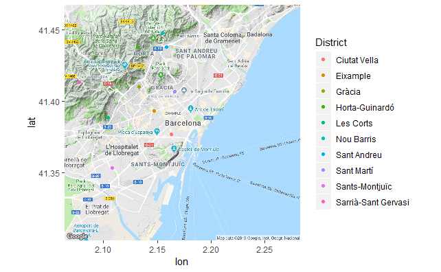
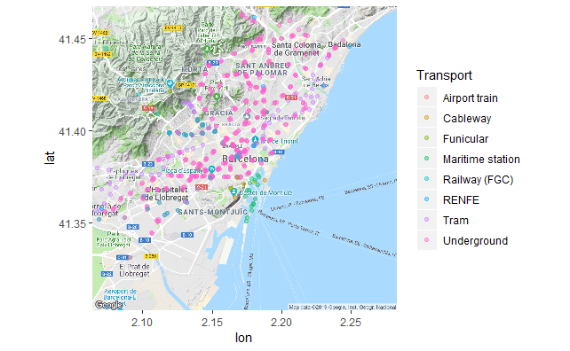
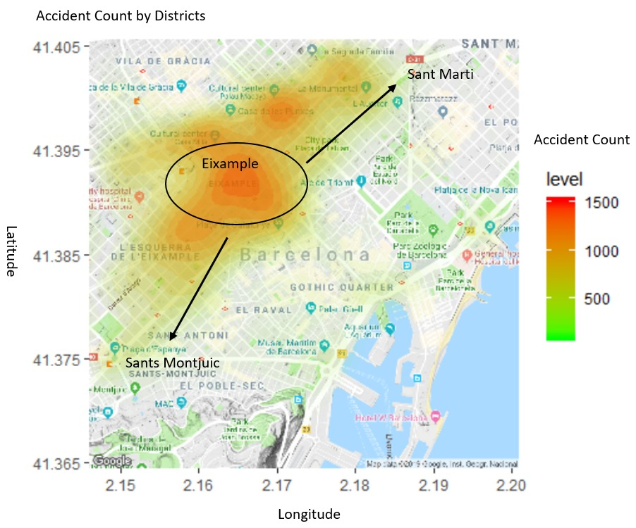
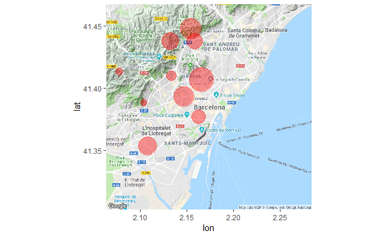

```{r setup, include=FALSE}
knitr::opts_chunk$set(echo = FALSE, warning = F, message = F, fig.width=6, fig.height=3.5)
```

## FC BARCELONA


## BARCELONA 1987


## QUESTIONS AT HAND:

- How is the public transport system in Barcelona?
- Which neighborhood has the worst accidental rate?
- The relationship between injury level and car invovement?
- Which month and time of the day have the most accidental rate?
- What is the immigration pattern to Barcelona?
- Whether unemployment is related to accidents in Barcelona?

## Datasets Used:
- Transport
- Accidents
- Population
- Nationality
- Age
- Gender
- Unemployment

## Barcelona Districts Map:

{width=90%}

## Public Transport 

{width=90%}

```{r cars, echo = FALSE}
suppressPackageStartupMessages(library(tidyverse))
suppressPackageStartupMessages(library(ggplot2))
suppressPackageStartupMessages(library(viridis))
suppressPackageStartupMessages(library(ggthemes))
unemploy <- read_csv("Data//unemployment.csv")
##accidents <- read_csv("..//Data//accidents_2017.csv")
accidents1 <- read_csv("Data//accidents_2017.csv")
accidents <- read_csv("Data//accidents_al.csv")
population <- read_csv("Data//population_al.csv")
immigration_nationality = read.csv("Data//nationality.csv")
immigration_age = read.csv("Data//age.csv")
immigration_sex = read.csv("Data//sex.csv")

```


## Accident Rate vs Population by District

```{r}

accidents%>%
  group_by(DISTRICT.NAME)%>%
  summarise(total_vic = sum(VICTIMS, na.rm = T))%>%
  mutate(vic_rate = round(100 * total_vic/ sum(total_vic),2))%>%
  arrange(desc(total_vic)) -> accidents_vic


population%>%
  group_by(DISTRICT.NAME)%>%
  summarise(total_pop = round(sum(NUMBER_P, na.rm = T))) -> dis_pop

left_join(accidents_vic, dis_pop, by = "DISTRICT.NAME")%>%
  arrange(desc(vic_rate)) -> dis_vic_pop

dis_vic_pop%>%
  ggplot(aes(x = DISTRICT.NAME, y = vic_rate, fill = total_pop)) +
  geom_col() +
  theme_bw() +
  coord_flip() +
  ggtitle("Accident Rate vs Districts") +
  xlab("Districts") +
  ylab("Accident Rate by %") +
  labs(fill = "Total Population")
    
```

## Accidents Heat Map
{height=90%}

## Vehicles Involved vs Injury Level by Districts

```{r}

accidents%>%
  group_by(DISTRICT.NAME)%>%
  summarise(sum_veh = sum(VEHICLES.INVOLVED),
            sum_mid = sum(MILD.INJURIES),
            sum_ser = sum(SERIOUS.INJURIES))%>%
  mutate(mid_rate = round(100 * sum_mid/ sum(sum_mid), 2),
         ser_rate = round(100 * sum_ser/ sum(sum_ser), 2),
         veh_rate = round(100 * sum_veh/ sum(sum_veh), 2))%>%
  ggplot(aes(x = DISTRICT.NAME, y = veh_rate, color = mid_rate, size = ser_rate)) +
  geom_point() +
  scale_colour_gradient(low = "Purple", high = "orange") +
  coord_flip() +
  theme_bw() +
  ggtitle("Vehicles vs Injury by District") +
  xlab("Districts") +
  ylab("Vehicle Involved by %") +
  labs(color = "Mild Injury by %", size = "Serious Injury by %")
  

```

## Accident Count based on Month & Time of Day

```{r}

monthvec <- c("December", "November", "October", "September", "August", "July", "June", "May", "April", "March", "February", "January")

accidents%>%
  mutate(month_fc = parse_factor(MONTH, levels = monthvec))%>%
  group_by(month_fc, PART.OF.THE.DAY)%>%
  summarise(total_vic = sum(VICTIMS))%>%
  ggplot(aes(x = month_fc, y = total_vic, fill = PART.OF.THE.DAY)) +
  geom_col() +
  coord_flip() +
  ggtitle("Accident count vs Month") +
  xlab("Accidents") +
  ylab("Month") +
  labs(fill = "Part of the Day")
  

```


## Interpretations from Accidents Data

- The top 3 high accidental rate cities are Exiample, Sant Marti and Sants Montjuic. However, the result is quite expected as these are also the   neighborhoods with the highest population.

- The accidents that involved vehicles tended to have victims with serious injury.

- The highest accident counts are in November and most of the accidents happened during afternoon.

## Immigration vs Nationality

```{r}


immigration_nationality %>%
  filter(Year == 2017) %>%
  select(Year, District.Name, Nationality, Number) %>%
  group_by(Nationality) %>%
  summarize(TotalNumber = sum(Number)) %>%
  arrange(desc(TotalNumber)) %>%
  filter(TotalNumber > 1000 & Nationality != "Spain") ->tidy_immigration_nationality


ggplot(tidy_immigration_nationality, aes(x =Nationality, y = TotalNumber, fill = Nationality)) + 
  geom_bar(stat = "identity") + 
  xlab("District Numbers") + 
  ylab("Immigrant Number") + 
  coord_flip()
```


```{r}
immigration_age %>%
  select(Year, District.Name, Age, Immigrants) %>%
  group_by(Age) %>%
  summarize(TotalNumber = sum(Immigrants)) %>%
  arrange(desc(TotalNumber)) %>%
  filter(TotalNumber > 1000) ->tidy_immigration_age
#**We can see the largest age group for the immigrants is 25-29 at 4,3637, followed by 30-34 at 4,3637, and then 20-24 at 3,4080.**
#**Tidy the data and group the data based on age**

```


## Immigrant Age Groups Analysis:
```{r}
ggplot(immigration_age, aes(x =as.character(District.Name), y = Immigrants, color = Age, fill = Age)) + 
  geom_boxplot() + 
  xlab("District Name") + 
  ylab("Immigrant Number") +
  coord_flip()
#**We can see that there is indeed a pattern between the age groups and the immigrants, with the light green ones(aged 30-50) being the most active**


```


```{r}
#**We can tidy the data and group the data by gender**

immigration_sex %>%
  select(Year, District.Name, Gender, Immigrants) %>%
  group_by(Gender) %>%
  summarize(TotalNumber = sum(Immigrants)) %>%
  arrange(desc(TotalNumber)) %>%
  filter(TotalNumber > 1000) ->tidy_immigration_sex
#**We can see there are slightly more female immigrants than males**

```

## Immigrant Gender Analysis:

```{r}
ggplot(immigration_sex, aes(x =as.character(District.Name), y = Immigrants, color = Gender, fill = Gender)) + 
  geom_boxplot() + 
  xlab("District Numbers") + 
  ylab("Immigrant Number") +
  coord_flip()
#**We can see that there are slightly more female immigrants than males**

```

## Interpretations from Immigration Data

- Most immmigrants come from Italy at 6,309, Pakistan at 9,707, China at 3,299, then Colombia at 3,255. 

- The largest age group for the immigrants is 25-29 at 21,319, followed by 30-34 at 15,602, and then 20-24 at 12,911.

- The age groups between 25-50 have more immigrants and bigger variances than the other age groups. 

- Overall there are slightly more females immigrants than males, females also have a slightly bigger variance than males.

## Gender Wise Unemployment

```{r, echo = FALSE}
gen <- c("Male" = "red",
         "Female" = "blue")

unemploy %>%
  select(`District Name`,Gender, Year, Number, Demand_occupation) %>%
  filter(Year == 2017 & `District Name` != "No consta") %>%
  arrange(`Gender`, `District Name`) %>%
  group_by(`Gender`, `District Name`) %>%
  summarize( Unemployed = sum(Number)) %>%
  ggplot(mapping = aes(x = `District Name`, y = Unemployed, fill = Gender)) +
  geom_col() +
  ggtitle("Unemployment w.r.t. Districts filled by Gender") +
  xlab("District Name") +
  ylab("Number Of Unemployed people") +
  theme_bw() +
 # scale_fill_discrete(name = "Gender") +
    scale_fill_manual(
    values = gen,
    limits = names(gen)) +
  theme(axis.text.x = element_text(size = 10, angle = 45, hjust = 1))
```

## Unemployment vs Accidents w.r.t. Districts

```{r, echo=FALSE}
##Getting total number of unemployed people by District name
unemploy %>%
  select(`District Name`, Year, Number, Demand_occupation) %>%
  filter(Year == 2017) %>%
  arrange(`District Name`) %>%
  group_by(`District Name`) %>%
  summarize( Number_Unemployed = sum(Number)) ->
  Unemployed

##Getting number of accidents by District Name
accidents1%>%
group_by(`District Name`)%>%
count(sort = TRUE) %>%
  rename(Number_of_Accidents = n) ->
  NewA

##Removing unknown rows from Accidents and Unemployment
NewAccidents <- NewA[!NewA$`District Name` == "Unknown",]

Unemployed <- Unemployed[!Unemployed$`District Name` == "No consta",]

##Merging the two dataframes
Total <- merge(Unemployed, NewAccidents, by = "District Name")

##Final ScatterPlot
Total %>%
  ggplot(mapping = aes(x = Number_Unemployed, y = Number_of_Accidents, color = `District Name`)) +
  geom_point(size = 5) +
  xlab("Number Unemployed") +
  ylab("Number of Accidents") +
  ggtitle("Unemployment vs Accidents") + 
  theme_bw() + 
  scale_color_manual(values = c("red", "blue", "green", "sky blue", "black", "grey", "brown", "gold", "dark green", "pink" ))
```

## Unemployment Mapped

{width=90%}

## Interpretations from Unemployment data:

- Male and Female unemployed people are almost the same in all the districts.
- Districts with the highest accidents also have the highest unemployed people in general.
- Thus, unemployment seems to affect accidents rate.

## Q & A
{width=90%, height=85%}

